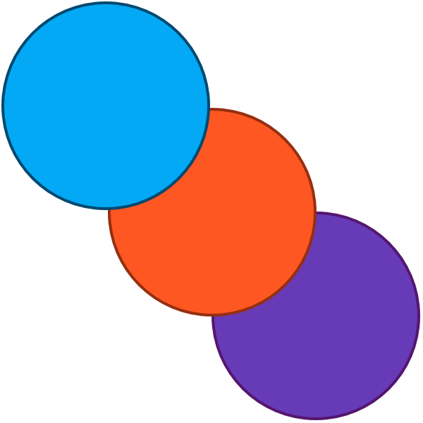

# MTCPref
Material Theme Chooser Preference

## Intro
While learning to theme using the AppCompat and Design Libraries, I started to have the need to support multiple themes. Different Material Color Schemes, as well as alternating between light backgrounds with dark text and dark backgrounds with light text. Setting this up can be a nightmare if you are unfamiliar with the process, not to mention it is a good bit of code to have 10 dark themes and 10 light themes. After the second app I needed to theme, I realised that we needed a library to take the place of all the imported code that comes along with preparing the themes, as well as selecting a theme to use.
###This Library will take care of the following
- Having an easy to use Preference Item to select a Theme 
- Having an easy to use API to access all colors of the selected Theme
- Having to make only 1 call in your Activity to set the Theme

## Usage
* Add Maven Repo for Jit in your build.gradle(Module)
```Gradle
allprojects {
    repositories {
		maven { url "https://jitpack.io" }
}
```

* Add MTCPref dependency in your build.gradle(app)
```Gradle
dependencies {
	compile 'com.github.johnnyb15613:MTCPref:v0.1.7'
}
```

* Add MTCPreferenceItem to your settings xml
```XML
<PreferenceScreen
	xmlns:android="http://schemas.android.com/apk/res/android"
	android:id="@+id/pref_screen">

	<PreferenceCategory
		android:title="Theme Settings">

		<com.jb15613.preference.themechooser.ThemeChooserPreference
			android:key="themeColorPref"
            android:title="Theme Color"
			default="Light Blue"
			android:dialogTitle="Theme Chooser"/>

    </PreferenceCategory>
	
</PreferenceScreen>
```

  * Result:
  
    
  

* Set the Theme in your Activity
```Java
public class MainActivity extends AppCompatActivity {

  @Override
  protected void onCreate(Bundle savedInstanceState) {
    super.onCreate(savedInstanceState);
		
	setTheme(ThemeChooserUtils.getTheme(this));
	
	// Make sure you call setTheme() BEFORE you call setContentView()
	
    setContentView(R.layout.main);
    
  } // onCreate
  
} // Class
```

## Utilities
* To theme views in layout resources use the following syntax
```XML
<View
	// Theme Color
	android:background="?attr/colorPrimary"

	// Theme Color Dark
	android:background="?attr/colorPrimaryDark"

	// Theme Color Accent
	android:background="?attr/colorPrimaryAccent"

	// Primary Bg Color
	android:background="?attr/primaryBgColor"

	// Secondary Bg Color
	android:background="?attr/secondaryBgColor"

	// Primary Text Color
	android:textColor="?attr/primaryTextColor"

	// Secondary Text Color
	android:textColor="?attr/secondaryTextColor"
/>
```

* To theme views in Java use the following syntax
```Java
void getColor() {

	// provide a float between 0.0 and 1.0 to get the theme color with opacity
	// 0.0 is transparent, 1.0 is fully opaque
  
	// Theme Color
	imageView.setColorFilter(ThemeChooserUtils.getThemeColor(context), PorterDuff.Mode.SRC_IN);
	imageView.setColorFilter(ThemeChooserUtils.getThemeColor(context, 0.7f), PorterDuff.Mode.SRC_IN);
  
	// Theme Color Dark
	Drawable d = DrawableCompat.wrap(getResources.getDrawable(R.drawable.my_drawable));
	DrawableCompat.setTint(d.mutate(), ThemeChooserUtils.getThemeDarkColor(context));
	DrawableCompat.setTint(d.mutate(), ThemeChooserUtils.getThemeDarkColor(context, 0.2f));
  
	// Theme Color Accent
	linearLayout.setBackgroundColor(ThemeChooserUtils.getThemeAccentColor(context));
	linearLayout.setBackgroundColor(ThemeChooserUtils.getThemeAccentColor(context, 0.5f));
  
	// Background Color
	linearLayout.setBackgroundColor(ThemeChooserUtils.getPrimaryBgColor(context));
	linearLayout.setBackgroundColor(ThemeChooserUtils.getSecondaryBgColor(context));
  
	// Text Color
	textView.setTextColor(ThemeChooserUtils.getPrimaryTextColor(context));
	textView.setTextColor(ThemeChooserUtils.getSecondaryTextColor(context));
	
}
```

## Screenshots
  

  

